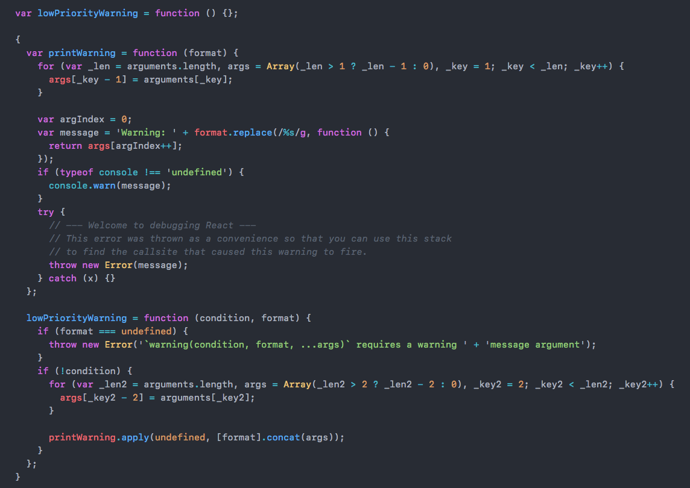
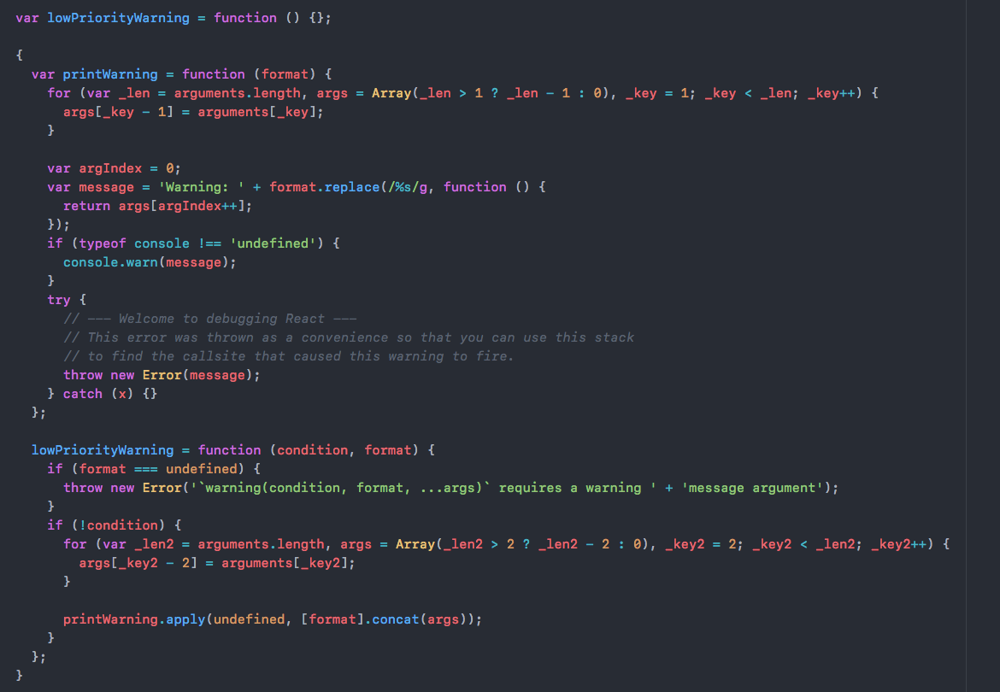

# one-dark-lite-syntax theme

This syntax theme is based off the official [one dark](https://atom.io/themes/one-dark-syntax) by the Atom team.

I love the one-dark theme however I feel it is a little visually 'heavy' (especially of the amount of red coloring) this theme differs in the following ways:

* Most variables are `grey` instead of `red`, giving pages are much 'lighter' feel
* `purple` is exclusively used for keywords - in `one-dark` purple is used for keywords but also for some other minor things
* Other misc differences

## Screenshot

One-dark-lite theme:

And here is the one-dark theme of the same code for comparison:

## Inspiration

* [one-dark-syntax](https://github.com/atom/one-dark-syntax)
* [one-dark-pro](https://marketplace.visualstudio.com/items?itemName=zhuangtongfa.Material-theme)
